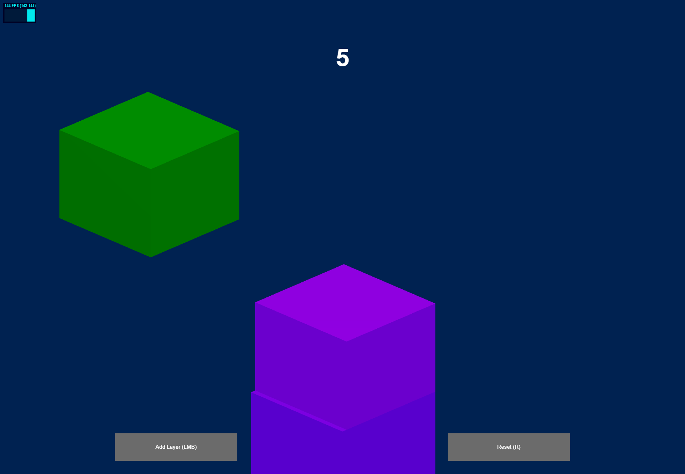

# Stacks Game



> <a href="https://stacks-two.vercel.app/">Live version here</a>

[](https://codesandbox.io/s/github/DaniloArantesF/Stacks/tree/main/?fontsize=14&hidenavigation=1&theme=dark)

### Setup
Clone this repository and install dependencies using the package manager of your choice.
Starting the live server is as simple as:
```bash
yarn dev
```

### To-Dos
- [ ] Add leaderboard and sharing options

### Known bugs

<!-- [⬆ Voltar ao topo](#3d-audio-visualizer)<br> -->